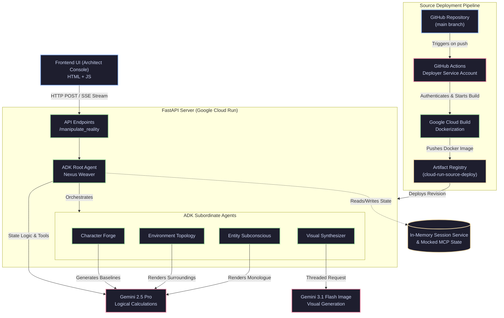

# Ontosurge Nexus Architecture

This document outlines the high-level system architecture of the Ontosurge Nexus application.

```mermaid
graph TD
    %% Styling
    classDef client fill:#1e1e2e,stroke:#89b4fa,stroke-width:2px,color:#cdd6f4
    classDef backend fill:#1e1e2e,stroke:#a6e3a1,stroke-width:2px,color:#cdd6f4
    classDef gemini fill:#1e1e2e,stroke:#f38ba8,stroke-width:2px,color:#cdd6f4
    classDef db fill:#1e1e2e,stroke:#f9e2af,stroke-width:2px,color:#cdd6f4

    Client["Frontend UI (Architect Console)<br/>HTML + JS"]:::client

    subgraph Backend ["FastAPI Server (Google Cloud Run)"]
        API["API Endpoints<br/>/manipulate_reality"]:::backend
        Orchestrator["ADK Root Agent<br/>Nexus Weaver"]:::backend
        
        subgraph Sub_Agents ["ADK Subordinate Agents"]
            Creator["Character Forge"]:::backend
            EnvRenderer["Environment Topology"]:::backend
            CharRenderer["Entity Subconscious"]:::backend
            ImgAgent["Visual Synthesizer"]:::backend
        end
    end

    %% External Services
    LLM_Pro["Gemini 2.5 Pro<br/>Logical Calculations"]:::gemini
    LLM_Flash["Gemini 3.1 Flash Image<br/>Visual Generation"]:::gemini
    
    %% Storage
    MockDB[("In-Memory Session Service<br/>& Mocked MCP State")]:::db

    subgraph CD ["Source Deployment Pipeline"]
        GH["GitHub Repository<br/>(main branch)"]:::client
        Actions["GitHub Actions<br/>Deployer Service Account"]:::gemini
        CloudBuild["Google Cloud Build<br/>Dockerization"]:::backend
        Artifacts["Artifact Registry<br/>(cloud-run-source-deploy)"]:::db
    end

    %% Connections
    Client -- "HTTP POST / SSE Stream" --> API
    API --> Orchestrator
    
    Orchestrator -- "State Logic & Tools" --> LLM_Pro
    Orchestrator -- "Orchestrates" --> Sub_Agents
    Orchestrator -. "Reads/Writes State" .-> MockDB
    
    Creator -- "Generates Baselines" --> LLM_Pro
    EnvRenderer -- "Renders Surroundings" --> LLM_Pro
    CharRenderer -- "Renders Monologue" --> LLM_Pro
    
    ImgAgent -- "Threaded Request" --> LLM_Flash

    %% Deployment Connections
    GH -- "Triggers on push" --> Actions
    Actions -- "Authenticates & Starts Build" --> CloudBuild
    CloudBuild -- "Pushes Docker Image" --> Artifacts
    Artifacts -- "Deploys Revision" --> Backend
```
